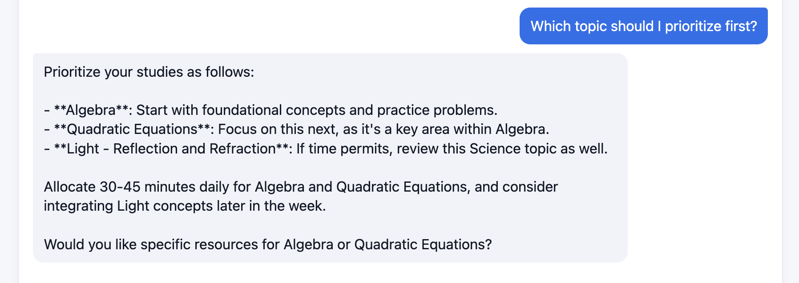
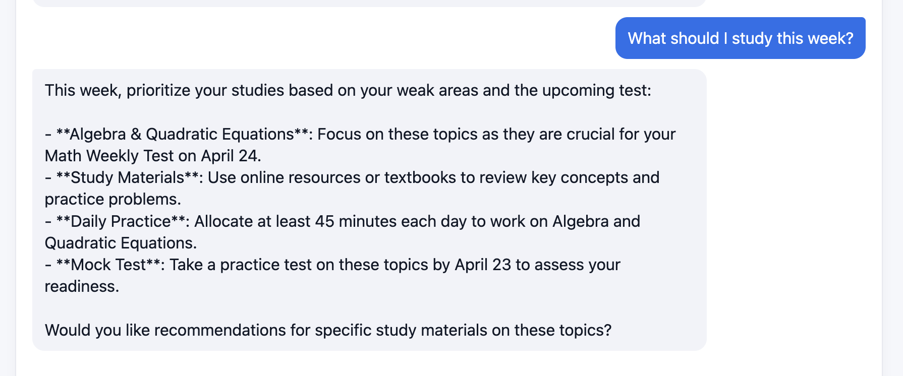
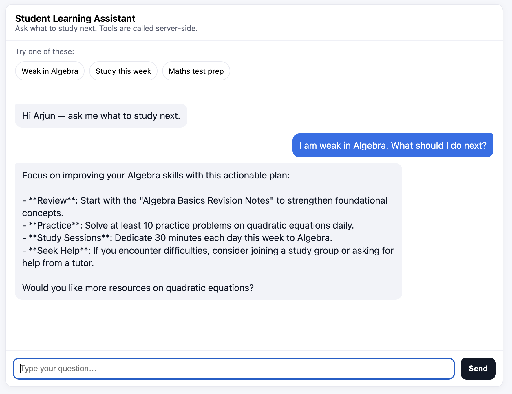
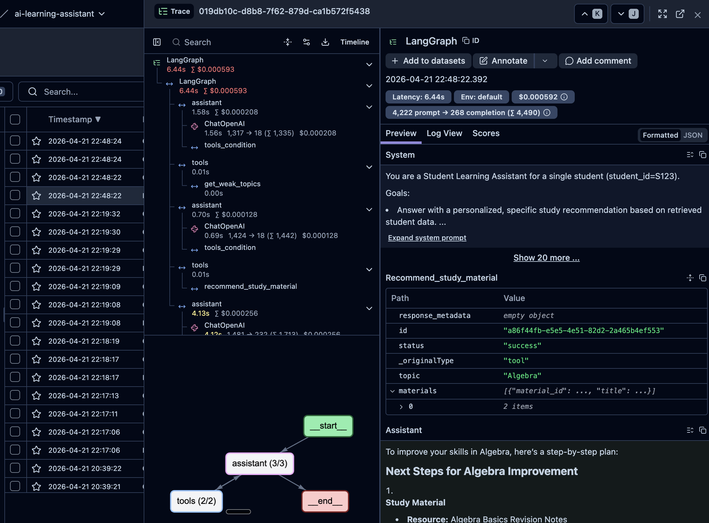
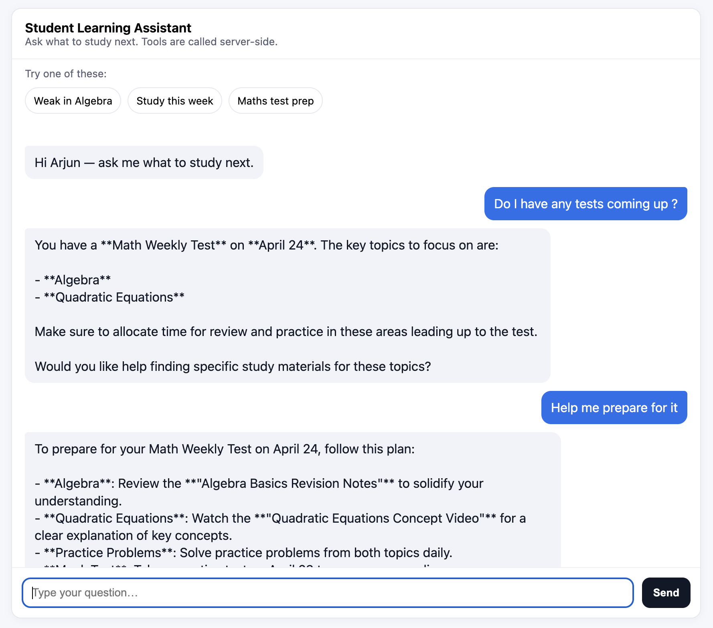
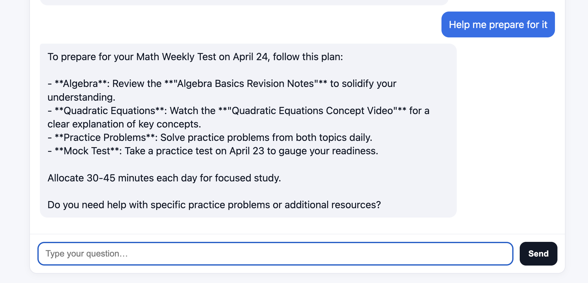

# Student Learning Assistant (AI-powered)

An AI assistant that helps a student decide **what to study next** by combining **retrieval from structured student data** (profile, performance, materials, upcoming tests) with a **tool-using LLM**.

- **LangGraph** — agent loop: LLM → optional tool calls → tools → LLM until complete  
- **LangChain** (`ChatOpenAI`) — model and tool binding  
- **FastAPI** — `POST /chat` plus a minimal static page at `/`  
- **Optional Langfuse** — tracing for debugging and evaluation  

---

## Setup

### Prerequisites

- Python 3.10+ recommended  
- An OpenAI API key  

### Local run

```bash
python -m venv .venv
source .venv/bin/activate   # Windows: .venv\Scripts\activate
pip install -r requirements.txt
```

Copy environment variables (see `.env.example`):

```bash
cp .env.example .env
# Edit .env and set OPENAI_API_KEY (required)
# Optional: OPENAI_MODEL, LANGFUSE_* for tracing
```

Start the server:

```bash
uvicorn app.main:app --reload --port 8000
```

- **API + minimal UI:** [http://localhost:8000/](http://localhost:8000/)  
- **Health:** `GET http://localhost:8000/healthz`  

### Docker

```bash
docker compose up --build
```

Then open [http://localhost:8001/](http://localhost:8001/) (port mapped in `docker-compose.yml`).  
If Langfuse runs on the host (e.g. `localhost:3001`), set `LANGFUSE_HOST=http://host.docker.internal:3001` in `.env` on macOS/Windows Docker.

### Cloud Run (optional)

The container listens on `$PORT` and `0.0.0.0`. Set `OPENAI_API_KEY` and optional `LANGFUSE_*` in the service environment. Example:

```bash
gcloud run deploy student-assistant \
  --source . \
  --region us-central1 \
  --allow-unauthenticated \
  --set-env-vars OPENAI_MODEL=gpt-4o-mini
```

---

## Approach

1. **Understand the question** — The user asks things like “What should I study this week?” or “I’m weak in Algebra—what next?”  

2. **Retrieve facts, don’t guess** — Student data lives in JSON under `data/`. The assistant **does not** invent test dates, scores, or materials. It uses **tools** that apply **structured filtering** (by `student_id`, date windows, topic fields) and returns JSON the model can reason over.  

3. **Tool-augmented reasoning** — A LangGraph runs until the model finishes: it may call `get_weak_topics`, `get_upcoming_tests`, and/or `recommend_study_material` one or more times, then answers with an actionable, prioritized plan.  

4. **Context over the session** — Recent **conversation history** is loaded and passed into the agent so follow-up messages stay coherent (e.g. “What about Science?” after discussing Math). See [Conversation history](#conversation-history) below.  

5. **Single demo student** — The sample dataset uses `student_id: S123`; the API wires that id for now.  

---

## Architecture

```
┌─────────────┐     POST /chat      ┌──────────────────────────────────────┐
│  Client     │ ──────────────────► │  FastAPI (app/main.py)               │
│  (UI / curl)│                     │  • loads last N turns from disk      │
└─────────────┘                     │  • run_agent(message, history, S123) │
       ▲                            └──────────────┬───────────────────────┘
       │                                           │
       │              ┌────────────────────────────▼────────────────────────┐
       │              │  LangGraph (app/graph.py)                           │
       │              │  System + context (today, student_id) + history +   │
       │              │  new user message → LLM ↔ ToolNode (tools) → …      │
       │              └──────────────┬────────────────────────────────────────┘
       │                             │
       │              ┌──────────────▼──────────────┐
       │              │  Tools (app/tools/…)        │
       │              │  • get_weak_topics          │
       │              │  • get_upcoming_tests       │
       │              │  • recommend_study_material │
       │              └──────────────┬──────────────┘
       │                             │ reads
       │              ┌──────────────▼──────────────┐
       └──────────────│  Data (app/data/loader.py)  │
          JSON reply  │  Cached load of data/*.json │
                      └─────────────────────────────┘
```

| Piece | Role |
|--------|------|
| `app/main.py` | HTTP API, static UI mount, session id, loads/appends conversation turns, calls `run_agent`. |
| `app/graph.py` | Builds and runs the LangGraph; merges system prompts, **conversation history**, and the new user message; optional Langfuse callbacks. |
| `app/prompts.py` | System instructions: prefer tools for facts, use “today” for week-style questions, no hallucinated dates/topics/materials. |
| `app/data/loader.py` | One-time load + cache of all dataset JSON files. |
| `app/tools/functions.py` | Tool implementations: weak topics + subject scores, tests in a date window, materials by topic string. |
| `app/conversations.py` | Append/load turns as JSONL under `conversations/<session_id>.jsonl`. |
| `data/` | `student_profile.json`, `performance_history.json`, `study_materials.json`, `upcoming_tests.json`. |

### Conversation history

- Each server process uses a **single session id**; turns are appended to `conversations/<session_id>.jsonl` (user + assistant text only).  
- On each `POST /chat`, the **most recent 20 turns** are loaded and converted into messages **between** the fixed system/context blocks and the **new** user message. That way follow-ups refer to the same thread without re-stating everything.  
- Docker Compose mounts `./conversations` so history survives container restarts when using Compose.  

---

## Key decisions

| Decision | Rationale |
|----------|-----------|
| **Structured retrieval via tools** | Assignment requires retrieval; filtering JSON by id/date/topic is simple, fast, and **auditable**—easy to verify what the model saw. |
| **Three explicit tools** | Matches the suggested functions (`get_weak_topics`, `get_upcoming_tests`, `recommend_study_material`) and keeps boundaries clear: tools return data; the LLM plans and explains. |
| **LangGraph for the loop** | Standard pattern for “model may call tools repeatedly” with a clear control flow and tracing hooks. |
| **Strong prompting against fabrication** | Reduces generic answers; if data is missing, behavior should reflect tool output (including errors), not invented facts. |
| **Conversation persistence** | Improves **continuity** for multi-turn dialogs without building a heavy chat product; scope is bounded (last N turns) to control cost and context size. |

---

## Limitations

- **No embedding / vector search** — Topic and material lookup is **string-based** (exact topic match for materials, modulo case). Paraphrases (“factoring problems”) may not match dataset labels unless the model maps language to a known topic name.  
- **Single hardcoded student (`S123`)** — No auth or multi-tenant routing; fine for the sample dataset, not a production user model.  
- **History is a sliding window** — Only the last **20** text turns are sent; very long chats lose early detail unless extended (see below).  
- **No guaranteed tool calls** — The system **instructs** the model to use tools for factual questions; edge cases could still skip tools—stronger guarantees would require deterministic routing or constrained generation.  
- **Basic UI** — Functional chat page only; no streaming, accounts, or rich formatting.  

---

## Next improvements

### Near-term (product + robustness)

- **Embeddings or fuzzy matching** for topics/materials so user phrasing aligns with dataset labels.  
- **`student_id` in the API** (and optional auth) so multiple students share one deployment.  
- **Deterministic prioritization** — e.g. score weak topics × proximity to test date × subject score, then let the LLM explain the ranked list.  

### Conversation and memory (extensions)

- **Summarize older turns** — When history exceeds N messages, periodically **compress** early dialogue into a short summary and inject it as an extra system or memory message, while keeping recent turns verbatim. That preserves long-thread coherence without unbounded context.  
- **Structured long-term memory** — e.g. extract and store facts like “student said they are **not confident in Science**” or “prefers short sessions” in a small profile or key-value store, and **merge** that into the context each turn. That goes beyond raw transcript replay and supports durable personalization (similar to “student goals / anxieties” in a real tutor).  

### Observability and evaluation

- Deeper **Langfuse** dashboards or offline eval sets using the suggested test queries.  

---

## API

### `POST /chat`

**Request:**

```json
{ "message": "What should I study this week?" }
```

**Response:**

```json
{ "response": "..." }
```

---

## Data

Sample files live in `data/`:

- `student_profile.json` — strengths, weaknesses, grade, study time, etc.  
- `performance_history.json` — subject-level scores.  
- `study_materials.json` — materials keyed by topic.  
- `upcoming_tests.json` — tests with dates and topic lists.  

The demo assumes **`S123`** as in the assignment sample.

---

## Screenshots

Below are captures from the running app and from optional **Langfuse** tracing. They illustrate **different tool invocations**, **observability**, and **multi-turn context** (including resolving pronouns like “it” using persisted conversation history).

### Tool calling (three tools)

The model chooses tools depending on the question: weak topics and scores, tests in a date window, or study materials for a named topic.

| `get_weak_topics` | `get_upcoming_tests` | `recommend_study_material` |
|-------------------|----------------------|----------------------------|
|  |  |  |

### Observability (Langfuse)

With `LANGFUSE_*` configured, traces show the agent loop (LLM steps, tool calls, and latency), which helps debug behavior and demonstrate correctness in review.



### Conversation history (coreference: “it”)

The API reloads recent turns from disk and passes them into the graph before each reply. In a follow-up that only says **“it”**, the assistant can still infer the referent (e.g. the topic or test from the prior turn) instead of answering generically.

| First turn + follow-up with “it” | Assistant uses prior context |
|----------------------------------|------------------------------|
|  |  |